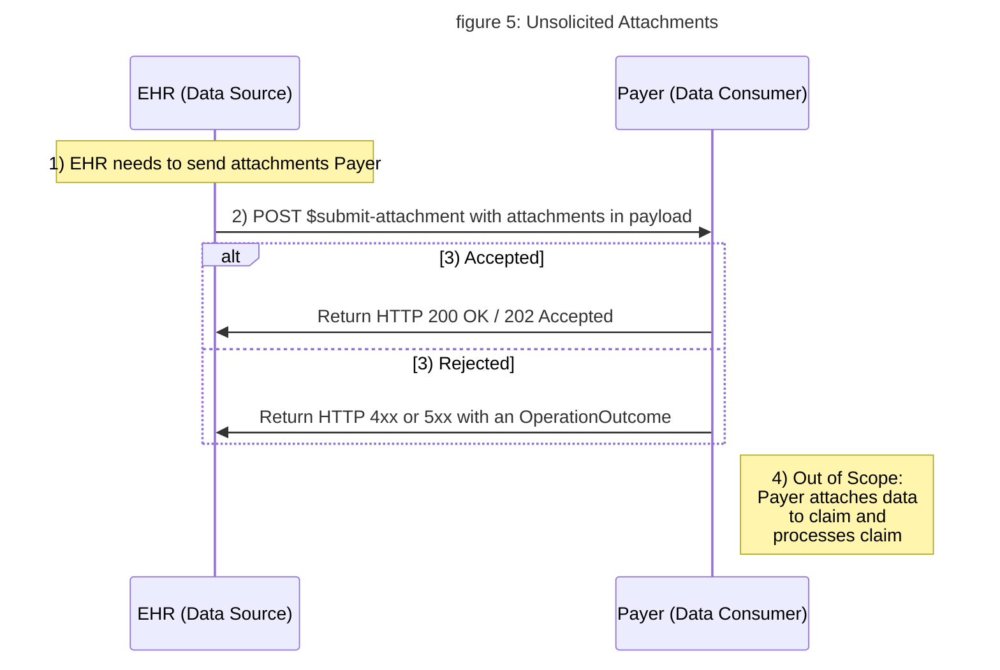

<!-- ---
tags: CDEX
title: Attachments
---

# Attachments -->

This page documents how to exchange clinical data using a FHIR based Unsolicited Attachments transaction.

**The following content is to be considered DRAFT, because it has not yet undergone HL7 balloting.**

### Attachments for Claims or Prior Authorization

Today claims come through X12, portal submission, or other ways.  The additional information to support these claims (a.k.a. attachments) come through X12 transactions, fax, portal, other ways *before, with or after* a claim.  In contrast to the Direct Query and Task Based approach, the CDex attachments for claims transaction is not a response to a FHIR-based request for clinical data. Instead it is either based on a set of pre-defined rules by the payer or jurisdictional mandates ("Unsolicited"), or the request for attachments comes through an X12 transaction ("Solicited").  The attachment is then re-attached to the claim and then processed.  Similarly for Prior Authorization, supporting information may be submitted with the prior authorization or in response to a request for more information after the initial submission.

This page documents a FHIR based approach for exchanging attachments for claims or prior authorization directly to a Payer.  The following scenarios illustrate where CDex Attachments transaction can be used:

1. Additional information based on a set of pre-defined rules by the payer or in state mandates without a specific request.
1. Attachments for a claim, because a Provider thinks the Payer will want it.
1. A Provider is under review and needs to provide additional information for all claims.
1. Filing a claim for two surgeons in one surgery.
1. Submit additional information for prior authorization.

In all these case, the payer will require a trading partner agreement for sending attachments based based on predefined rules.
{:.warning}

### `$submit-attachment` Operation

This guide defines a simple RESTful interaction for exchanging attachments using [`$submit-attachment`], a FHIR [Operation].  This operation accepts the clinical attachments and the necessary information needed to re-attach them to the claim or prior authorization, and returns a transaction layer http response. The re-attachment to the claim or prior authorization, subsequent processing, and response the the Payer is out of scope for this guide.  See the [`$submit-attachment`] operation definition and examples below for further details.

### FHIR Technical Workflow

As shown in the figure 7 below, the attachments are “pushed” using the `$submit-attachment` operation directly to the Payer or an Intermediary.



<!--

 -->

1. EHR assemble attachments and re-attachment data for a claim or prior authorization
1. EHR invokes `$submit-attachment` operation to submit attachments to Payer
1. Payer responds with an http transactional layer response either accepting or rejecting transaction
1. Payer attaches data to claim or prior authorization and processes it (out of scope)

### Attachments Transaction Scenario

In the following example, a Provider creates a claim and sends supporting CCDA documents using the FHIR operation, [`$submit-attachment`]:

`POST [base]/$submit-attachment`

#### Scenario 1: CCDA Document Attachments

- Based on a set of pre-defined rules set by the Payer, Provider submits CCDA Documents as additional information for a claim. (*Unsolicited Attachments*).
  - Typically when the attachments are CCDA documents as in this scenario, they are already digitally signed and supply provenance information. Therefore FHIR signatures and external Provenance resources are not needed.
- Provider knows the Payer's endpoint for Sending attachments.  Note that the `$submit-attachment` operation can be used by any HTTP end-point, not just FHIR RESTful servers.
- "Unsolicited Attachments" imply that the *Provider* assigns the claim and line item identifiers (in other words, a "placer identifier") upon claim generation.
- Re-association of attachments to the Claim, subsequent Claim processing and adjudication, and follow up communication are out of scope and out of band.



### Signatures

Some data consumers may require that the data they receive are signed. When performing CDex Attachments transactions and signatures are required, the following general rules apply:

- The signature **SHALL** represent a *human provider* signature on resources attesting that the information is true and accurate.
- The returned object is either already inherently signed (for example, a wet signature on a PDF or a digitally signed CCDA) or it **SHALL** transformed into a signed [FHIR Document](http://hl7.org/fhir/documents.html) and `Bundle.signature`  **SHALL** be used to exchange the signature.

#### The Data Consumer Requirements

When a electronic or digital signature is required for CDex Attachments, the Data Consumer **SHALL**:

- *Pre-negotiate* the signature requirement with the organization representing the Data Source.
   - If the signature requirement is pre-negotiated, it **SHALL** be assumed that *all* attachments will be signed.
   - Conversely, it **SHOULD** be assumed that no CDex Attachments transaction will be signed unless there exists a pre-negotiated agreement
   - Based on the agreement, *Electronic* or *digital* signatures **MAY** be used  
- Follow the documentation in the [Signatures] page for validating signatures.

#### Data Source Requirements

Refer to the [Data Source/Responder Requirements](task-based-approach.html#data-sourceresponder-requirements) section in the Task Based Approach to signatures.

#### Example: *Signed* FHIR Resource Attachments

- This example is the same as Scenario 1 above except that the attachment is a FHIR resource and a FHIR digital signature is required.
  - Unlike Scenario 1 which uses DocumentReference resource to index the CCDA attachment, FHIR resources representing the clinical data are transformed into a FHIR Document bundle and the bundle is digitally signed.
- See the [Signatures] page for complete worked example on how the signature was created.




