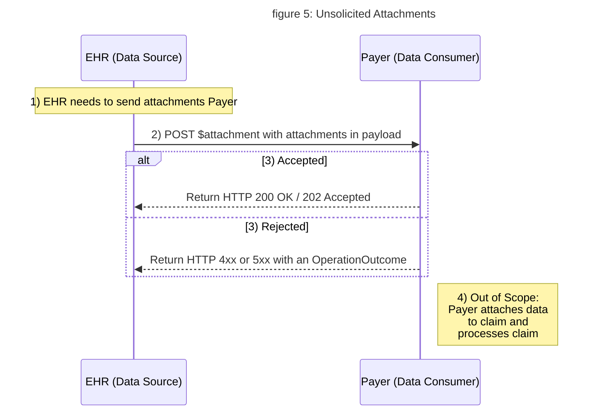

# Unsolicited Attachments

**The following content is to be considered DRAFT, because it has not yet undergone HL7 balloting.**

### Attachments for Claims or Prior Authorization

The guide documents a FHIR based approach for exchanging attachments for claims or prior authorization directly to a Payer. In contrast to the Direct Query and Task Based approach, the CDex Unsolicited Attachment transaction is not a response to a FHIR-based request for clinical data. Instead it is either based on a set of pre-defined rules by the payer or jurisdictional mandates ("Unsolicited"), or the request for attachments comes through an X12 transaction or Prior Authorization ("Solicited").

Today claims come through X12, portal submission, or other ways.  The additional information to support these claims (a.k.a. attachments) come through X12 transactions, fax, portal, other ways *before, with or after* a claim.  The attachment is then re-attached to the claim and the claim processed. 

The following scenarios illustrate where Unsolicited Attachments transaction can be used:
  
1. Additional information based on a set of pre-defined rules by the payer or in state mandates without a specific request.
1. Attachments for a claim, because a Provider thinks the Payer will want it.
1. A Provider is under review and needs to provide additional information for all claims.
1. Filing a claim for two surgeons in one surgery.
1. Submit additional information for prior authorization.

In all these case, the payer will require a trading partner agreement for unsolicited attachments based based on predefined rules.

### `$attachment` Operation

This guide defines a simple RESTful interaction for exchanging attachments using `$attachment`, a [FHIR Operation].  This operation accepts the clinical attachments and the necessary information needed to re-attach them to the claim, and returns a transaction layer http response. The re-attachment to the claim, subsequent processing, and response the the Payer is out of scope for this guide.  See the [operation definition]() for further details.

### FHIR Technical Workflow : 

As shown in the figure 5 below, the attachments are “pushed” using the `$attachment` operation directly to the Payer or an Intermediary.



<!-- 

-->

1. EHR assemble attachments and re-attachment data for a claim
1. EHR invokes `$attachment` operation to submit attachments to Payer
1. Payer responds with an http transactional layer response either accepting or rejecting transaction
1. Payer attaches data to claim and processes claim (out of scope) 

### Signatures

Some data consumers may require that the data they receive are signed. When performing Unsolicited Attachments transactions and signatures are required, the following general rules apply:

- The signature **SHALL** represent a *human provider* signature on resources attesting that the information is true and accurate.
- The returned object is either already inherently signed (for example, a wet signature on a PDF or a digitally signed CCDA) or it **SHALL** transformed into a signed [FHIR Document](http://hl7.org/fhir/documents.html) and `Bundle.signature`  **SHALL** be used to exchange the signature.

#### The Data Consumer Requirements

When a electronic or digital signature is required for Unsolicited Attachments, the Data Consumer **SHALL**:

- *Pre-negotiate* the signature requirement with the organization representing the Data Source.
   - If the signature requirement is pre-negotiated, it **SHALL** be assumed that *all* attachments will be signed.
   - Conversely, it **SHOULD** be assumed that no Unsolicited Attachments transaction will be signed unless there exists a pre-negotiated agreement
   - Based on the agreement, *Electronic* or *digital* signatures **MAY** be used  
- Follow the documentation in the [Generating and Verifying *Signed* Resources](/2_qdYLjXR3KyYlk78Ye9Gg) page for validating signatures.

#### Data Source Requirements

Refer to this [section](task-based-approach.html#data-sourceresponder-requirements) in the Task Based Approach to signatures.

### Examples

#### Scenario 1

In the following example, the submitted attachment is a CCDA document.



#### Scenario 2

In the following example a FHIR signature is required on the attachment which is a FHIR resource.

- See [Generating and Verifying *Signed* Resources](/2_qdYLjXR3KyYlk78Ye9Gg) page for complete worked example on how the signature was created.




